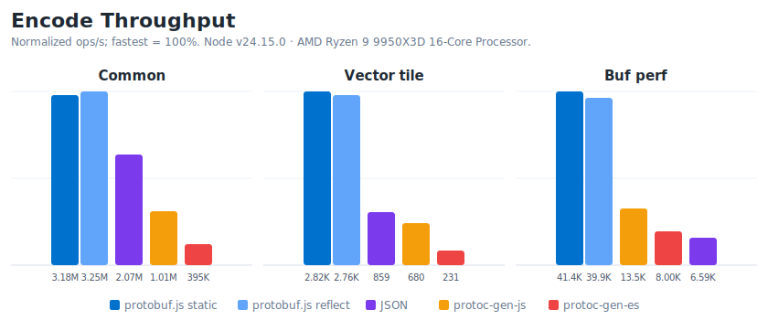
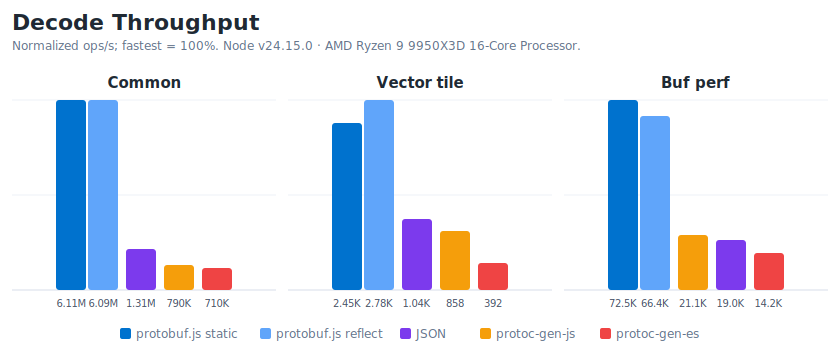

<h1><p align="center"><br/>protobuf.js</p></h1>
<p align="center">
  <a href="https://github.com/protobufjs/protobuf.js/actions/workflows/test.yml"></a>
  <a href="https://github.com/protobufjs/protobuf.js/actions/workflows/release.yaml"></a>
  <a href="https://npmjs.org/package/protobufjs"></a>
  <a href="https://npmjs.org/package/protobufjs"></a>
  <a href="https://www.jsdelivr.com/package/npm/protobufjs"></a>
</p>

**Protocol Buffers** are a language-neutral, platform-neutral, extensible way of serializing structured data for use in communications protocols, data storage, and more, originally designed at Google ([see](https://protobuf.dev/)).

**protobuf.js** is a very fast, conformant, and unusually versatile JavaScript implementation of Protocol Buffers for Node.js and browsers. It works with `.proto` files out of the box, does not require protoc, and supports runtime reflection as well as specialized code generation with strong TypeScript declarations.

protobuf.js is independently maintained with participation from the upstream Protocol Buffers ecosystem. If it is important to your project or organization, or if you depend on it commercially, [consider supporting](https://github.com/sponsors/dcodeIO) its ongoing maintenance. Sponsorship helps make bug fixes, releases, LTS/security handling, and user support more sustainable.

## Getting started

Getting up and running is simple: Install the package, load a `.proto` file, and you are all set to encode and decode Protobuf messages. From there, protobuf.js grows with your requirements: Add any combination of capabilities, such as [code generation](#code-generation), [TypeScript declarations](#typescript-integration), [transport-agnostic services](#services), [programmatic schemas](#programmatic-schemas), [optional extensions](#extensions), and more as needed. All in one flexible toolkit.

### Install

```sh
npm install protobufjs
```

The [command line utility](./cli/#readme) for generating reflection bundles, static code and TypeScript declarations is published as an add-on package:

```sh
npm install --save-dev protobufjs-cli
```

The CLI is a JS-native protobuf.js toolchain that does not require setting up `protoc`. If you prefer a `protoc`-based workflow, it provides `protoc-gen-pbjs` as an option.

#### Browser builds

Canonical browser builds for each runtime variant are [provided via the jsDelivr CDN](https://cdn.jsdelivr.net/npm/protobufjs@8.X.X/dist/), supporting CommonJS, AMD and global `window.protobuf`. Make sure to pin an exact version in production.

## Usage

The examples below use this schema:

```proto
syntax = "proto3";

package awesomepackage;

message AwesomeMessage {
  string awesome_field = 1;
}
```

protobuf.js converts `.proto` field names to camelCase by default, so `awesome_field` is used as `awesomeField` in JavaScript. Use the `keepCase` option when loading or parsing `.proto` files to preserve field names as written.

### Load a schema

```ts
const protobuf = require("protobufjs");

const root = await protobuf.load("awesome.proto");
const AwesomeMessage = root.lookupType("awesomepackage.AwesomeMessage");
```

Optionally use `load()` with a callback, or `loadSync()` for synchronous loading on Node.js.

### Encode and decode

```ts
const payload = { awesomeField: "hello" };

// Optionally create a message instance from already valid data
const message = AwesomeMessage.create(payload);

const encoded = AwesomeMessage.encode(message).finish();
const decoded = AwesomeMessage.decode(encoded);
```

`encode` expects a message instance or equivalent plain object and does not verify input implicitly. Use `create` to create a message instance from already valid data when useful, `verify` for plain objects whose shape is not guaranteed, and `fromObject` when conversion from broader JavaScript objects is needed.

Plain objects can be encoded directly when they already use protobuf.js runtime types: numbers for 32-bit numeric fields, booleans for `bool`, strings for `string`, `Uint8Array` or `Buffer` for `bytes`, arrays for repeated fields, and plain objects for maps. Map keys are the string representation of the respective value or an 8-character hash string for 64-bit keys.

Unknown fields present on the wire are discarded by default. To preserve and forward unknown fields, set `reader.discardUnknown = false` before decoding with that reader, or make this the default for subsequently created readers with `Reader.discardUnknown = false`. Preserved unknown field data can be dropped from a decoded message with `delete message.$unknowns`.

### Convert plain objects

Conversion is an explicit interoperability boundary. `fromObject` accepts common JavaScript inputs such as enum values by name, base64 bytes, decimal 64-bit strings, `Long`, and `BigInt`; `toObject` lets callers choose the output expected by their application or transport.

```ts
const message = AwesomeMessage.fromObject({ awesomeField: 42 });
const object = AwesomeMessage.toObject(message, {
  longs: String,
  enums: String,
  bytes: String
});
```

Common `ConversionOptions` are:

| Option | Effect |
|--------|--------|
| `longs: BigInt` | Converts 64-bit values to bigint values |
| `longs: String` | Converts 64-bit values to decimal strings |
| `longs: Number` | Converts 64-bit values to JS numbers (may lose precision) |
| `enums: String` | Converts enum values to names |
| `bytes: String` | Converts bytes to base64 strings |
| `defaults: true` | Includes default values for unset fields |
| `arrays: true` | Includes empty arrays for repeated fields |
| `objects: true` | Includes empty objects for map fields |
| `oneofs: true` | Includes virtual oneof discriminator properties |

## Message API

Message types expose focused methods for validation, conversion, and binary I/O.

* **encode**(message: `Message | object`, writer?: `Writer`): `Writer`  
  Encodes a message or equivalent plain object. Call `.finish()` on the returned writer to obtain a buffer.

* **encodeDelimited**(message: `Message | object`, writer?: `Writer`): `Writer`  
  Encodes a length-delimited message.

* **decode**(reader: `Reader | Uint8Array`): `Message`  
  Decodes a message from protobuf binary data.

* **decodeDelimited**(reader: `Reader | Uint8Array`): `Message`  
  Decodes a length-delimited message.

* **create**(properties?: `object`): `Message`  
  Creates a message instance from already valid data.

* **verify**(object: `object`): `null | string`  
  Checks whether a plain object can be encoded as-is. Returns `null` if valid, otherwise an error message.

* **fromObject**(object: `object`): `Message`  
  Converts broader JavaScript input into a message instance.

* **toObject**(message: `Message`, options?: `ConversionOptions`): `object`  
  Converts a message instance to a configurable plain JavaScript object.

* **message.toJSON**(): `object`  
  Converts a message instance to JSON-compatible output using default conversion options.

Message instances provide runtime identity, so they can be tested with `instanceof`. Their `toJSON` method integrates them with `JSON.stringify`.

Length-delimited methods read and write a varint byte length before the message, which is useful for streams and framed protocols.

If required fields are missing while decoding proto2 data, `decode` throws `protobuf.util.ProtocolError` with the partially decoded message available as `err.instance`.

## Runtimes

protobuf.js provides three runtime entry points, keeping parser and reflection support optional: Runtime `.proto` loading needs the parser, JSON/reflection bundles need reflection support, and generated static modules only need the minimal runtime.

| Import                  | Includes           | Use when
| ----------------------- | ------------------ | --------
| `protobufjs`            | Reflection, Parser | You load `.proto` files at runtime
| `protobufjs/light.js`   | Reflection         | You load JSON bundles or build schemas programmatically
| `protobufjs/minimal.js` | Static runtime     | You use generated static code

The full build includes the light build, and the light build includes the minimal runtime.

## Code generation

Use [`protobufjs-cli`](./cli/#readme) to generate reflection bundles, static JavaScript code, and matching TypeScript declarations, either directly with `pbjs` or through the optional `protoc-gen-pbjs` plugin for `protoc`.

Reflection keeps schemas as JSON metadata and generates optimized functions at runtime. Static code emits schema-specific, reflection-free functions ahead of time. The main tradeoffs are how schemas are loaded, how bundle size scales with schema size, and whether reflection metadata should remain available at runtime.

| Target | Output | Minimum Runtime |
|--------|--------|-----------------|
| `json` | JSON bundle | `protobufjs/light.js` |
| `json-module` | JSON bundle module | `protobufjs/light.js` |
| `static-module` | Static code module | `protobufjs/minimal.js` |

Module targets support `--wrap default` for CommonJS and AMD, plus `esm`, `commonjs`, `amd`, and `closure`; `--wrap` can also load a custom wrapper module.

### Static modules

Static modules emit dedicated JavaScript for your schema, so they only need `protobufjs/minimal.js` at runtime.

```sh
npx pbjs -t static-module -w esm -o awesome.js --dts awesome.proto
```

```ts
import { awesomepackage } from "./awesome.js";

const message = awesomepackage.AwesomeMessage.create({ awesomeField: "hello" });
```

While static code is verbose by design, its repeated patterns compress well with Brotli or gzip, and it works in [CSP](https://w3c.github.io/webappsec-csp/)-restricted environments that disallow unsafe-eval without sacrificing performance.

### Reflection bundles

Reflection bundles store schemas as compact JSON metadata, avoiding `.proto` parsing at runtime and letting browsers load schema metadata in one request. While they require at least `protobufjs/light.js`, large schemas can produce smaller combined bundles than equivalent static modules because common code is shared through reflection.

```sh
npx pbjs -t json -o awesome.json awesome1.proto awesome2.proto ...
```

```ts
const bundle = require("./awesome.json");

const root = protobuf.Root.fromJSON(bundle);
const AwesomeMessage = root.lookupType("awesomepackage.AwesomeMessage");
```

```sh
npx pbjs -t json-module -w esm -o awesome.js --dts awesome.proto
```

```ts
import { awesomepackage } from "./awesome.js";

const AwesomeMessage = awesomepackage.AwesomeMessage;
```

JSON modules export the reflection root and, with `-w esm`, also provide top-level named exports that align with static modules. Their declarations mirror `static-module` typings, but because JSON modules are backed by reflection objects, message instances should be created with `MyMessage.create(...)` instead of constructors. Code using `create(...)` works with static modules as well.

### TypeScript integration

protobuf.js works with TypeScript out of the box: the runtime API is typed, and generated JavaScript can be paired with strong TypeScript declarations in the same CLI invocation. Generated output is directly usable from JavaScript without a transpile step, and strongly typed in TypeScript projects, with type-checked oneofs and JavaScript-friendly plain-object input.

For example, given the oneof:

```proto
message Profile {
  oneof contact {
    string email = 1;
    string phone = 2;
  }
}
```

Generated declarations narrow both the `contact` oneof and the concrete values:

```ts
const profile = Profile.create({
  contact: "email",
  email: "hello@example.com"
});

if (profile.contact === "email") {
  profile.email; // string
}

const decoded = Profile.decode(bytes);
if (decoded.contact === "phone") {
  decoded.phone; // string
}
```

Plain objects can use the same narrowed shape through a collision-free scoped type:

```ts
const object: Profile.$Shape = {
  contact: "email",
  email: "hello@example.com"
};
```

## Advanced usage

### Programmatic schemas

The full and light builds can construct schemas directly through reflection:

```ts
const AwesomeMessage = new protobuf.Type("AwesomeMessage")
  .add(new protobuf.Field("awesomeField", 1, "string"));

const root = new protobuf.Root()
  .define("awesomepackage")
  .add(AwesomeMessage);
```

### Custom message classes

A reflected type can use a custom class as its runtime constructor:

```ts
class AwesomeMessage extends protobuf.Message<AwesomeMessage> {
  awesomeField = "";

  constructor(properties?: protobuf.Properties<AwesomeMessage>) {
    super(properties);
    // ...
  }

  customInstanceMethod() {
    return this.awesomeField.toLowerCase();
  }
}

root.lookupType("awesomepackage.AwesomeMessage").ctor = AwesomeMessage;

const decoded = AwesomeMessage.decode(bytes);
decoded.customInstanceMethod(); // string
```

protobuf.js will populate the constructor with the usual static runtime methods and use it for decoded messages. When assigning constructors manually, add the type to its parent namespace/root first if fields reference other reflected types. In TypeScript, custom members are visible when using the custom class type in consuming code.

### Services

protobuf.js supports service clients built from service definitions. The service API is transport-agnostic: provide an `rpcImpl` function to connect it to HTTP, WebSocket, gRPC, or another transport.

```js
function myRpcImpl(method, requestData, callback) {
  // method.name
  // method.path
  // method.requestStream?
  // method.responseStream?
  performRequest(requestData, function(err, responseData) {
    callback(err, responseData);
  });
}

const myService = MyService.create(myRpcImpl/*, requestDelimited?, responseDelimited? */);
```

See [examples/streaming-rpc.js](./examples/streaming-rpc.js) for a streaming example.

### Extensions

The following extensions provide descriptor conversion and text-based protobuf formats when reflection metadata is available. Most applications only need the binary APIs above.

#### Descriptors

protobuf.js uses a compact JSON-based reflection representation internally that is easy to embed and fast to parse, so schemas can be loaded directly without first decoding binary descriptor blobs or postprocessing their full JSON representation. See [ext/descriptor](./ext/README.md#descriptor) for use cases that need conversion between reflected roots and `protoc` descriptor messages.

#### ProtoJSON

Protocol Buffers support a special [ProtoJSON format](https://protobuf.dev/programming-guides/json/) to share data with systems that do not support the binary wire format, for example when implementing gateways. Spec-compliant ProtoJSON is supported via [ext/protojson](./ext/README.md#protojson).

#### Text Format

Protocol Buffers [Text Format](https://protobuf.dev/reference/protobuf/textformat-spec/) is a special syntax for representing protobuf data in text form, which can be useful for configurations or tests. Spec-compliant Text Format is supported via [ext/textformat](./ext/README.md#textformat).

## Conformance

protobuf.js is validated against the official Protocol Buffers conformance suite, achieving complete binary wire-format conformance for **Proto2**, **Proto3** and **Editions**, plus complete **ProtoJSON** and **Text Format** conformance in its default configuration with reflection metadata present.

<!-- BEGIN CONFORMANCE DATA -->

| Category   |               Total |            Required |         Recommended |
| ---------- | ------------------: | ------------------: | ------------------: |
| Binary     | 100.00% (2835/2835) | 100.00% (1958/1958) |   100.00% (877/877) |
| ↳ Proto2   |   100.00% (707/707) |   100.00% (489/489) |   100.00% (218/218) |
| ↳ Proto3   |   100.00% (707/707) |   100.00% (486/486) |   100.00% (221/221) |
| ↳ Editions | 100.00% (1421/1421) |   100.00% (983/983) |   100.00% (438/438) |
| ProtoJSON  | 100.00% (2796/2796) | 100.00% (2362/2362) |   100.00% (434/434) |
| TextFormat |   100.00% (909/909) |   100.00% (845/845) |     100.00% (64/64) |
| Overall    | 100.00% (6540/6540) | 100.00% (5165/5165) | 100.00% (1375/1375) |

<!-- END CONFORMANCE DATA -->

[Structured results](https://github.com/protobufjs/protobuf.js/actions/workflows/test.yml?query=branch%3Amaster+event%3Apush) are available as CI artifacts. In case of doubt, [see also](https://dev.to/dcode/when-the-model-is-the-marketing-device-a-protobuf-short-story-2p7p).

## Performance

In both reflection and reflection-free modes, protobuf.js builds specialized encoders and decoders on top of hand-tuned reader and writer primitives, making it a strong fit from battery-powered devices to high-traffic servers, or generally for projects and their downstream users adopting protobuf as a faster, smaller alternative to JSON.

The repository includes a [small benchmark](./bench) over a common message shape, plus Mapbox's vector tile fixture and Buf's perf payload, both unmodified. For each case, it compares protobuf.js encode and decode throughput against JSON encode/decode, Google's protoc-gen-js, and Buf's protoc-gen-es. Results show that protobuf.js is consistently faster than the other Protobuf implementations, up to an order of magnitude on real-world data.

<!-- BEGIN BENCHMARK DATA -->



| Case | protobuf.js static | protobuf.js reflect | JSON | protoc-gen-js | protoc-gen-es |
| --- | ---: | ---: | ---: | ---: | ---: |
| Common | 3.18M ops/s | 3.25M ops/s | 2.07M ops/s | 1.01M ops/s | 395K ops/s |
| Vector tile | 2.82K ops/s | 2.76K ops/s | 859 ops/s | 680 ops/s | 231 ops/s |
| Buf perf | 41.4K ops/s | 39.9K ops/s | 6.59K ops/s | 13.5K ops/s | 8.00K ops/s |



| Case | protobuf.js static | protobuf.js reflect | JSON | protoc-gen-js | protoc-gen-es |
| --- | ---: | ---: | ---: | ---: | ---: |
| Common | 6.11M ops/s | 6.09M ops/s | 1.31M ops/s | 790K ops/s | 710K ops/s |
| Vector tile | 2.45K ops/s | 2.78K ops/s | 1.04K ops/s | 858 ops/s | 392 ops/s |
| Buf perf | 72.5K ops/s | 66.4K ops/s | 19.0K ops/s | 21.1K ops/s | 14.2K ops/s |

<!-- END BENCHMARK DATA -->

[Structured results](./bench/results/latest.json) of this run are available as committed artifacts.

To run the benchmark yourself on your own hardware:

```sh
npm --prefix bench install
npm run bench
```

## Compatibility

Supported runtimes are browsers, Node.js v12+, Deno and Bun. When using the CLI with Bun, Node.js must also be installed.

## Security

Security-impacting reports are handled through coordinated GitHub Security Advisories where appropriate. See [SECURITY.md](./SECURITY.md) for supported release lines and reporting instructions.

## Development

```sh
git clone https://github.com/protobufjs/protobuf.js
cd protobuf.js
npm install
npm --prefix cli install
```

Running the tests:

```sh
npm test
```

Building the development and production versions with their respective source maps to `dist/`:

```sh
npm run build
```

## Additional documentation

* [API Documentation](https://protobufjs.github.io/protobuf.js)
* [Changelog](./CHANGELOG.md)
* [Protocol Buffers Documentation](https://protobuf.dev/)
