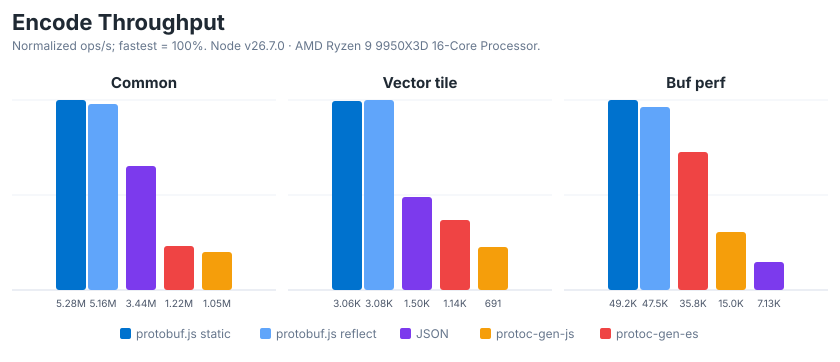
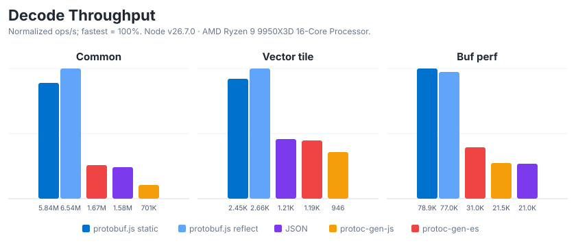

<h1><p align="center"><br/>protobuf.js</p></h1>
<p align="center">
  <a href="https://github.com/protobufjs/protobuf.js/actions/workflows/test.yml"></a>
  <a href="https://github.com/protobufjs/protobuf.js/actions/workflows/release.yaml"></a>
  <a href="https://npmjs.org/package/protobufjs"></a>
  <a href="https://npmjs.org/package/protobufjs"></a>
  <a href="https://www.jsdelivr.com/package/npm/protobufjs"></a>
</p>

**protobuf.js** is a very fast, conformant, and unusually versatile JavaScript implementation of [Protocol Buffers](https://protobuf.dev) for Node.js and browsers. It is independently maintained with contributions from the upstream Protocol Buffers project, works with `.proto` schemas without requiring `protoc`, and supports runtime reflection as well as specialized code generation with matching TypeScript declarations.

If protobuf.js is important to your project or organization, or if you depend on it commercially, [consider supporting](https://github.com/sponsors/dcodeIO) its ongoing maintenance. Sponsorship helps make bug fixes, releases, LTS/security handling, and user support more sustainable.

## Getting started

Getting up and running is simple: Install the package, load a schema, and you are all set to encode and decode Protobuf messages. From there, protobuf.js grows with your requirements: Add code generation with TypeScript declarations, transport-agnostic services, support for text-based formats, and more as needed.

### Install

```sh
npm install protobufjs
```

The [command line utility](./cli/#readme) for generating reflection bundles, static code and TypeScript declarations is published as an add-on package:

```sh
npm install --save-dev protobufjs-cli
```

The CLI is a JS-native protobuf.js toolchain that does not require setting up `protoc`. If you prefer a `protoc`-based workflow, it provides `protoc-gen-pbjs` as an option.

#### Browser builds

Canonical browser builds are [provided via the jsDelivr CDN](https://cdn.jsdelivr.net/npm/protobufjs@8.X.X/dist/), supporting CommonJS, AMD and global `window.protobuf`. Make sure to pin an exact version in production.

## Usage

The examples below use this schema:

```proto
syntax = "proto3";

package awesomepackage;

message AwesomeMessage {
  string awesome_field = 1;
}
```

protobuf.js converts `.proto` field names to camelCase by default, so `awesome_field` is used as `awesomeField` in JavaScript. Use the `keepCase` option when loading or parsing `.proto` files to preserve field names as written.

### Load a schema

```ts
const protobuf = require("protobufjs");

const root = await protobuf.load("awesome.proto");
const AwesomeMessage = root.lookupType("awesomepackage.AwesomeMessage");
```

Optionally use `load()` with a callback, or `loadSync()` for synchronous loading on Node.js. Imports resolve relative to the importing file by default. To resolve imports against a specific base directory, create a `Root` and override `root.resolvePath` before calling `root.load()`.

### Encode and decode

```ts
const payload = { awesomeField: "hello" };

// Optionally create a message instance from already valid data
const message = AwesomeMessage.create(payload);

const encoded = AwesomeMessage.encode(message).finish();
const decoded = AwesomeMessage.decode(encoded);
```

`encode` expects a message instance or equivalent plain object and does not verify input implicitly. Use `create` to create a message instance from already valid data when useful, `verify` for plain objects whose shape is not guaranteed, and `fromObject` when conversion from broader JavaScript objects is needed.

Plain objects can be encoded directly when they already use protobuf.js runtime types: numbers for 32-bit numeric fields, booleans for `bool`, strings for `string`, `Uint8Array` or `Buffer` for `bytes`, arrays for repeated fields, and plain objects for maps. Map keys are the string representation of the respective value or an 8-character hash string for 64-bit keys.

Note that, as with any structured binary format, decoded structures incur runtime memory overhead beyond their encoded representation. Applications processing untrusted input should therefore apply appropriate input-size and concurrency limits to bound memory use. For this reason, unknown fields present on the wire are intentionally discarded as the safer default, but can be retained by setting `reader.discardUnknown = false` per reader, or by setting `Reader.discardUnknown = false` to make it the default for subsequently created readers. Preserved unknown field data can also be explicitly dropped with `delete message.$unknowns`.

### Convert plain objects

Conversion is an explicit interoperability boundary. `fromObject` accepts common JavaScript inputs such as enum values by name, base64 bytes, decimal 64-bit strings, `Long`, and `BigInt`; `toObject` lets callers choose the output expected by their application or transport.

```ts
const message = AwesomeMessage.fromObject({ awesomeField: 42 });
const object = AwesomeMessage.toObject(message, {
  longs: String,
  enums: String,
  bytes: String
});
```

Common `ConversionOptions` are:

| Option | Effect |
|--------|--------|
| `longs: BigInt` | Converts 64-bit values to bigint values |
| `longs: String` | Converts 64-bit values to decimal strings |
| `longs: Number` | Converts 64-bit values to JS numbers (may lose precision) |
| `enums: String` | Converts enum values to names |
| `bytes: String` | Converts bytes to base64 strings |
| `defaults: true` | Includes default values for unset fields |
| `arrays: true` | Includes empty arrays for repeated fields |
| `objects: true` | Includes empty objects for map fields |
| `oneofs: true` | Includes virtual oneof discriminator properties |

## Message API

Message types expose focused methods for validation, conversion, and binary I/O.

* **encode**(message: `Message | object`, writer?: `Writer`): `Writer`  
  Encodes a message or equivalent plain object. Call `.finish()` on the returned writer to obtain a buffer.

* **encodeDelimited**(message: `Message | object`, writer?: `Writer`): `Writer`  
  Encodes a length-delimited message.

* **decode**(reader: `Reader | Uint8Array`): `Message`  
  Decodes a message from protobuf binary data.

* **decodeDelimited**(reader: `Reader | Uint8Array`): `Message`  
  Decodes a length-delimited message.

* **create**(properties?: `object`): `Message`  
  Creates a message instance from already valid data.

* **verify**(object: `object`): `null | string`  
  Checks whether a plain object can be encoded as-is. Returns `null` if valid, otherwise an error message.

* **fromObject**(object: `object`): `Message`  
  Converts broader JavaScript input into a message instance.

* **toObject**(message: `Message`, options?: `ConversionOptions`): `object`  
  Converts a message instance to a configurable plain JavaScript object.

* **message.toJSON**(): `object`  
  Converts a message instance to JSON-compatible output using default conversion options.

Message instances provide stable runtime identity for testing with `instanceof`.

Length-delimited methods read and write a varint byte length before the message, which is useful for streams and framed protocols.

If required fields are missing while decoding proto2 data, `decode` throws `protobuf.util.ProtocolError` with the partially decoded message available as `err.instance`.

## Code generation

Use [`protobufjs-cli`](./cli/#readme) to generate schema-specific code, either directly with `pbjs` or through the optional `protoc-gen-pbjs` plugin for `protoc`.

protobuf.js offers two code-generation modes, both with matching TypeScript declarations: reflection modules generate optimized code at runtime with reflection metadata retained; static modules generate reflection-free code ahead of time. Both use the same runtime package and automatically import only the runtime capabilities they need.

| Target | Output | Runtime entry |
|--------|--------|---------------|
| `json-module` | Reflection module | `protobufjs/light.js` (without parser) |
| `static-module` | Static code module | `protobufjs/minimal.js` (without reflection) |

Module targets support `--wrap default` for CommonJS and AMD, plus `esm`, `commonjs`, `amd`, and `closure`; `--wrap` can also load a custom wrapper module.

### Static modules

Static modules emit dedicated, reflection-free JavaScript code for your schema.

```sh
npx pbjs -t static-module -w esm -o awesome.js --dts awesome.proto
```

```ts
import { awesomepackage } from "./awesome.js";

const message = awesomepackage.AwesomeMessage.create({ awesomeField: "hello" });
```

Static code is repetitive by design, but compresses unusually well with Brotli or gzip and works in [CSP](https://w3c.github.io/webappsec-csp/)-restricted environments.

### Reflection modules

Reflection modules wrap schemas as compact JSON metadata while avoiding `.proto` parsing at runtime.

```sh
npx pbjs -t json-module -w esm -o awesome.js --dts awesome.proto
```

```ts
import { awesomepackage } from "./awesome.js";

const AwesomeMessage = awesomepackage.AwesomeMessage;
```

Declarations for reflection modules mirror `static-module` typings. Because JSON modules export reflection objects, message instances should be created with `MyMessage.create(...)` rather than constructors. Code using `create(...)` works with static modules as well. Separately, `-t json` can serialize reflection metadata as bare JSON bundles for use with `load()` or `Root.fromJSON()`.

### TypeScript integration

protobuf.js works with TypeScript out of the box: its runtime API is typed, and generated code can be paired with matching TypeScript declarations in a single CLI invocation. Declarations are strongly typed, including discriminated unions for oneofs and scoped types for plain-object usage:

```proto
message Profile {
  oneof contact {
    string email = 1;
    string phone = 2;
  }
}
```

```ts
const profile = Profile.create({
  contact: "email",
  email: "hello@example.com"
});

if (profile.contact === "email") {
  profile.email; // string
}

const decoded = Profile.decode(bytes);
if (decoded.contact === "phone") {
  decoded.phone; // string
}
```

The same narrowed shape is available for plain-object inputs:

```ts
const object: Profile.$Shape = {
  contact: "email",
  email: "hello@example.com"
};
```

## Advanced usage

### Programmatic schemas

Schemas can be constructed directly through reflection:

```ts
const AwesomeMessage = new protobuf.Type("AwesomeMessage")
  .add(new protobuf.Field("awesomeField", 1, "string"));

const root = new protobuf.Root()
  .define("awesomepackage")
  .add(AwesomeMessage);
```

### Custom message classes

A reflected type can use a custom class as its runtime constructor:

```ts
class AwesomeMessage extends protobuf.Message<AwesomeMessage> {
  awesomeField = "";

  constructor(properties?: protobuf.Properties<AwesomeMessage>) {
    super(properties);
    // ...
  }

  customInstanceMethod() {
    return this.awesomeField.toLowerCase();
  }
}

root.lookupType("awesomepackage.AwesomeMessage").ctor = AwesomeMessage;

const decoded = AwesomeMessage.decode(bytes);
decoded.customInstanceMethod(); // string
```

protobuf.js will populate the constructor with the usual static runtime methods and use it for decoded messages. When assigning constructors manually, add the type to its parent namespace/root first if fields reference other reflected types. In TypeScript, custom members are visible when using the custom class type in consuming code.

### Services

protobuf.js supports service clients built from service definitions. The service API is transport-agnostic: provide an `rpcImpl` function to connect it to HTTP, WebSocket, gRPC, or another transport.

```js
function myRpcImpl(method, requestData, callback) {
  // method.name
  // method.path
  // method.requestStream?
  // method.responseStream?
  performRequest(requestData, function(err, responseData) {
    callback(err, responseData);
  });
}

const myService = MyService.create(myRpcImpl/*, requestDelimited?, responseDelimited? */);
```

See [examples/streaming-rpc.js](./examples/streaming-rpc.js) for a streaming example.

See [examples/grpc-service.js](./examples/grpc-service.js) for an integration example with [@grpc/grpc-js](https://www.npmjs.com/package/@grpc/grpc-js).

### Extensions

The following extensions provide descriptor conversion and text-based protobuf formats when reflection metadata is available. Most applications only need the binary APIs above.

#### Descriptors

protobuf.js uses a compact JSON-based reflection representation internally. See [ext/descriptor](./ext/README.md#descriptor) for use cases that need conversion between reflected roots and `protoc` descriptor messages.

#### ProtoJSON

Protocol Buffers support a special [ProtoJSON format](https://protobuf.dev/programming-guides/json/) to share data with systems that do not support the binary wire format, for example when implementing gateways. Spec-compliant ProtoJSON is supported via [ext/protojson](./ext/README.md#protojson).

#### Text Format

Protocol Buffers [Text Format](https://protobuf.dev/reference/protobuf/textformat-spec/) is a special syntax for representing protobuf data in text form, which can be useful for configurations or tests. Spec-compliant Text Format is supported via [ext/textformat](./ext/README.md#textformat).

## Conformance

protobuf.js is validated against the official Protocol Buffers conformance suite. It passes all required and recommended tests for the **Proto2**, **Proto3** and **Editions** binary wire formats, with complete **ProtoJSON** and **Text Format** support available as optional extensions when those formats are needed.

<!-- BEGIN CONFORMANCE DATA -->

| Category   |               Total |            Required |         Recommended |
| ---------- | ------------------: | ------------------: | ------------------: |
| Binary     | 100.00% (2835/2835) | 100.00% (1958/1958) |   100.00% (877/877) |
| ↳ Proto2   |   100.00% (707/707) |   100.00% (489/489) |   100.00% (218/218) |
| ↳ Proto3   |   100.00% (707/707) |   100.00% (486/486) |   100.00% (221/221) |
| ↳ Editions | 100.00% (1421/1421) |   100.00% (983/983) |   100.00% (438/438) |
| ProtoJSON  | 100.00% (2796/2796) | 100.00% (2362/2362) |   100.00% (434/434) |
| TextFormat |   100.00% (909/909) |   100.00% (845/845) |     100.00% (64/64) |
| Overall    | 100.00% (6540/6540) | 100.00% (5165/5165) | 100.00% (1375/1375) |

<!-- END CONFORMANCE DATA -->

[Structured results](https://github.com/protobufjs/protobuf.js/actions/workflows/test.yml?query=branch%3Amaster+event%3Apush) of the conformance tests are also available as CI artifacts.

## Performance

Both reflection and static modes use specialized encoders and decoders backed by the same hand-tuned reader and writer primitives.

The repository includes a [benchmark suite](./bench) you can run yourself. It compares protobuf.js with other general-purpose JavaScript implementations across three substantially different cases: our classic common message shape and two unmodified, structurally distinct fixtures sourced externally. The suite measures each library's recommended serialization and deserialization path using identical schemas and inputs, with JSON included as an additional baseline. Across these cases, protobuf.js is a clear upgrade over using JSON and consistently the fastest Protobuf implementation by a considerable margin.

<!-- BEGIN BENCHMARK DATA -->

<picture>
  <source media="(prefers-color-scheme: dark)" srcset="./bench/results/encode-dark.svg">
  <source media="(prefers-color-scheme: light)" srcset="./bench/results/encode-light.svg">
  
</picture>

<details>
<summary>Show table</summary>

| Implementation | Common | Vector tile | Buf perf |
| --- | ---: | ---: | ---: |
| protobuf.js static | **5.34M ops/s** &nbsp; <small>1.0x</small> | **3.09K ops/s** &nbsp; <small>1.0x</small> | 43.1K ops/s &nbsp; <small>1.0x</small> |
| protobuf.js reflect | 4.89M ops/s &nbsp; <small>1.1x</small> | 3.03K ops/s &nbsp; <small>1.0x</small> | **43.3K ops/s** &nbsp; <small>1.0x</small> |
| JSON | 2.09M ops/s &nbsp; <small>2.6x</small> | 897 ops/s &nbsp; <small>3.4x</small> | 6.70K ops/s &nbsp; <small>6.5x</small> |
| protoc-gen-js | 1.03M ops/s &nbsp; <small>5.2x</small> | 700 ops/s &nbsp; <small>4.4x</small> | 13.9K ops/s &nbsp; <small>3.1x</small> |
| protoc-gen-es | 402K ops/s &nbsp; <small>13.3x</small> | 235 ops/s &nbsp; <small>13.2x</small> | 8.22K ops/s &nbsp; <small>5.3x</small> |

</details>

<picture>
  <source media="(prefers-color-scheme: dark)" srcset="./bench/results/decode-dark.svg">
  <source media="(prefers-color-scheme: light)" srcset="./bench/results/decode-light.svg">
  
</picture>

<details>
<summary>Show table</summary>

| Implementation | Common | Vector tile | Buf perf |
| --- | ---: | ---: | ---: |
| protobuf.js static | 6.45M ops/s &nbsp; <small>1.1x</small> | 2.70K ops/s &nbsp; <small>1.1x</small> | **81.7K ops/s** &nbsp; <small>1.0x</small> |
| protobuf.js reflect | **6.93M ops/s** &nbsp; <small>1.0x</small> | **2.99K ops/s** &nbsp; <small>1.0x</small> | 80.3K ops/s &nbsp; <small>1.0x</small> |
| JSON | 1.37M ops/s &nbsp; <small>5.0x</small> | 1.06K ops/s &nbsp; <small>2.8x</small> | 19.5K ops/s &nbsp; <small>4.2x</small> |
| protoc-gen-js | 811K ops/s &nbsp; <small>8.5x</small> | 851 ops/s &nbsp; <small>3.5x</small> | 21.7K ops/s &nbsp; <small>3.8x</small> |
| protoc-gen-es | 691K ops/s &nbsp; <small>10.0x</small> | 376 ops/s &nbsp; <small>8.0x</small> | 14.3K ops/s &nbsp; <small>5.7x</small> |

</details>

<!-- END BENCHMARK DATA -->

[Structured results](./bench/results/latest.json) and environment details for this run are also available as committed artifacts.

To run the benchmark on your own hardware:

```sh
npm --prefix bench install
npm run bench
```

## Compatibility

Supported runtimes are browsers, Node.js v12+, Deno and Bun. When using the CLI with Bun, Node.js must also be installed.

## Security

Security-impacting reports are handled through coordinated GitHub Security Advisories where appropriate. See [SECURITY.md](./SECURITY.md) for supported release lines and reporting instructions.

## Development

```sh
git clone https://github.com/protobufjs/protobuf.js
cd protobuf.js
npm install
npm --prefix cli install
```

Running the tests:

```sh
npm test
```

Building the development and production versions with their respective source maps to `dist/`:

```sh
npm run build
```

## Additional documentation

* [API Documentation](https://protobufjs.github.io/protobuf.js)
* [Changelog](./CHANGELOG.md)
* [Protocol Buffers Documentation](https://protobuf.dev/)
