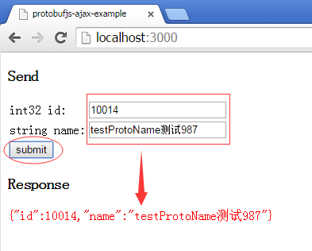

# ProtoBuf.js Ajax example
This example shows how to use HTTP Ajax to transfer protocol buffers

## Instructions
1. Set up dependencies: `npm install`
2. Run: `node server.js`
3. Open `http://localhost:3000` in a recent browser

## Snapshot
below is the TestProtobuf.proto

```java
package TestProtobuf;

option java_package = "com.why.game.protobuf";
option java_outer_classname = "TestProtobuf";

message TestProto{
	optional int32 id = 1;
	optional string name = 2;
}
```

you will the Snapshot when you visit `http://localhost:3000` as below
