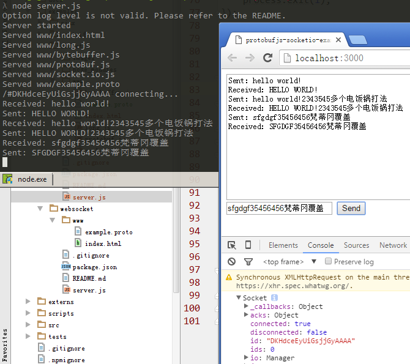

# ProtoBuf.js SocketIO example
This example shows how to use HTTP Ajax to transfer protocol buffers

## Instructions
1. Set up dependencies: `npm install`
2. Run: `node server.js`
3. Open `http://localhost:3000` in a recent browser

## Snapshot
below is the example.proto

```java
message Message {
    required string text = 1;
}
```

you will the Snapshot when you visit `http://localhost:3000` as below
